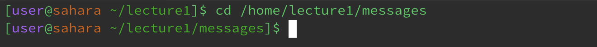

# Lab Report 1
## `cd`
__Command with *no* arguments__

The command `cd` stands for "Change Directory," and its primary purpose is to change the current working directory within a shell or command prompt session. A working directory, also known as the current working directory (CWD), refers to the directory or current location in which a user is currently operating or executing commands. When the command `cd` is ran with no arguments, no error is produce nor is their any output in the terminal. This is because the `cd` command when used without arguments, defaults to switching the directory to the user's home directory. Your home directory is the directory associated with your user account, and it is where you start when you open a terminal. The behavior of the `cd` command without arguments is designed to provide a convenient way to return to your home directory.

__Command with a path to a *directory* argument__

When the command `cd` is used with a work directory argument, no output is produced in the terminal. However, the command will switch the current working directory to the specificed work directory. In this case, the working directory that was run with the command was `/home/lecture1/messages`. There was no error in the output.

__Command with a path to a *file* argument__

When the command `cd` ia used with a path to a file as an argument, the terminal produces an output of a message that reads that the file path `/home/lecture1/messages/en-us.txt` is not a directory. Attempting to change the current directory to a file will result in an error because the command `cd` is meant for directories, not files.

___

## `ls`
__Command with *no* arguments__

Running the command `ls` with no arguments, the terminal produces a list of the contents of the current working directory. In this case the terminal produces the contents of the working directory. 

__Command with a path to a *directory* argument__ 

The command `ls` when ran with a path to a working directory as an argument, lists the contents of the specified directory. As seen above, the terminal output lists the content of the directory /home/lecture1/messages.

__Command with a path to a *file* argument__

If you provide a file as an argument to ls, it will display information about that specific file, such as its name, size, and permissions (work on this shit)

___

## `cat`
__Command with *no* arguments__

 Without any arguments, cat expects input from the user, so it waits for you to enter text. It's not commonly used in this way.

__Command with a path to a *directory* argument__

Using cat with a directory as an argument is not valid because cat is meant to display the contents of files, not directories.

__Command with a path to a *file* argument__

This command will display the content of the specified file, /path/to/file.txt, in the terminal.
