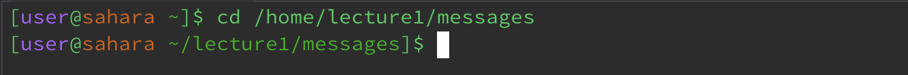
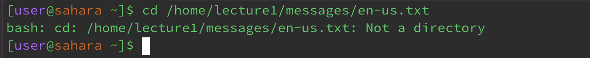
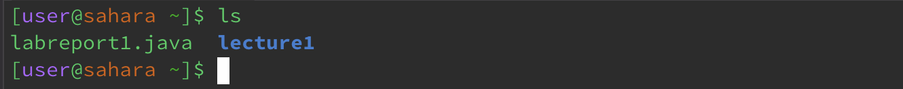
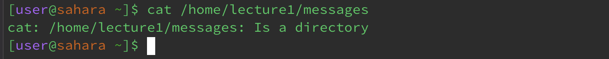

# Lab Report 1
## `cd`
__Command with *no* arguments__

The command `cd` stands for "Change Directory," and its primary purpose is to change the current working directory within a shell or command prompt session. A working directory, also known as the current working directory (CWD), refers to the directory or current location in which a user is currently operating or executing commands. When the command `cd` is ran with no arguments, no error is produced nor is their any output in the terminal. This is because the `cd` command when used without arguments, defaults to switching the directory to the user's home directory. Your home directory is the directory associated with your user account, and it is where you start when you open a terminal. The behavior of the `cd` command without arguments is designed to provide a convenient way to return to your home directory.

__Command with a path to a *directory* argument__

When the command `cd` is used with a path to a working directory argument, no output nor error is produced in the terminal. However, the command will switch the current working directory to the path of the specificed work directory provided as the argument. In this case, the working directory that was run with the command was `/home/lecture1/messages`, so command `cd` changed my current working directory which was my home directory to the path of the lecture1/messages directory as specified. Directory paths can be specified as either absolute paths or relative paths (relative to the current directory). Absolute paths describe the full path from the root directory - starting point for all directory structures and absolute paths - of the file system to the target file or directory, regardless of the current working directory. While, relative paths specify the location of a file or directory in relation to the current working directory. Both absolute and relative paths work with command `cd` to change the current directory to a specified directory. 

__Command with a path to a *file* argument__

When the command `cd` ia used with a path to a file as an argument, the terminal produces an output of a message that reads that the file path `/home/lecture1/messages/en-us.txt` is not a directory. The command is thus invalid and will result in the terminal to produce an error message. This is because the the primary purpose of the `cd` command is to change directories, not to access files. The command `cd` expects a directory as an argument, not a file. After receiving an error message, the current working directory will also remain unchanged because the file path specified in the argument is not used to change the working directory. In summary, using the `cd` command with a path to a file as an argument is not a valid use of the command, and will result in an error. cd is intended exclusively for changing the current working directory to a different directory, and it cannot be used for individual files. 

___

## `ls`
__Command with *no* arguments__

The `ls` command is used to list the files and directories in a directory. The primary purpose of the `ls` command is to provide information about the contents of a directory such as file names and directory names. Running the command `ls` with no arguments will result in the terminal to default to produce a list of the contents of the user's home directory. In this case, the terminal produces the contents of my home directory which are `labreport1.java` and `lecture1`. The output of ls may be colorized to make it more visually distinguishable between directories and files, such as how `lecture1` is blue. The command `ls` provides essential information about files and directories, allowing them to be viewed and organized in directories efficiently. 

__Command with a path to a *directory* argument__ 

When the `ls` command is used with a path to a directory as an argument, it lists the contents of the specified directory provided instead of the current working directory. As seen above, the command `ls` used with the path to the directory `/home/lecture1/messages` lists the content of the specified directory, which are the files `en-us.txt`, `es-mx.txt`, and `zh-cn.txt`. The `ls` command typically displays the list of files and directories in multiple columns, making it easier to read when there is a lot of content. The list is sorted alphabetically, with directories appearing first followed by files. In essence, the `ls` command when used with a path to a directory, provides a list of the contents of the specified directory, similar to when listing the contents of the current working directory. This is useful in examining the contents of a specific directory without changing the current working directory.

__Command with a path to a *file* argument__

When the `ls` command is used with a path to a file as an argument, displays the path to the file in the terminal. In this case, it means that the file specified in the path exists at the provided location, but it does not provide any other detailed information about the file just simply displays the path of the file as entered. This is useful for quickly verifying whether a file exists at a specific location without displaying the file's content. The command does not change the current working directory, it remains the same before and after running the `ls` command.  

___

## `cat`
__Command with *no* arguments__

The `concatenate` command, also shortened to `cat`, is primarily used to concatenate - combine the content of files into a single file - and show the contents of one or more files. Without any arguments, cat expects an input from the user in the terminal and waits for you to enter text interactively to then display that input on the terminal. This is known as interactive mode and is the default when using the `cat` command with no arguments. You can type lines of text, and when you press "Enter," the cat command will display what you entered on the screen. You can continue entering text until you decide to exit the interactive mode. However, when using the `cat` command in interactive mode, the command does not create or directly change any files, it is only able to display the text you type in the terminal. The current working directory also remains unchanged.

__Command with a path to a *directory* argument__

When the cat command is used with a path to a directory as an argument, it is not valid and results in an error considering that the `cat` command is designed to exclusively work with the contents of files, not directories. The command recognizes that it cannot read and display the contents of a directory and thus, it produces an error message. As shown above, the error message will read that the provided arguemnt, in this case `/home/lecture1/messages` is a directory and not a file so it cannot perform its usual function of displaying file contents.

__Command with a path to a *file* argument__

When the cat command is used with a path to a file as an argument, it reads the content of the specified file and displays that content on the terminal. In this case, I provided the path to the text file `en-us.txt` as the argument to command `cat`, that then read the text in that file and displayed the text `Hello, world!` in the terminal. The command displays the content line by line, exactly how it is with no additional formatting or content changes. The command `cat` does not change the current working directory, it remains the same before and after running the command considering that the command is only applicable for reading and displaying content of files. It operates solely on the specified files and does not involve any directory navigation.
