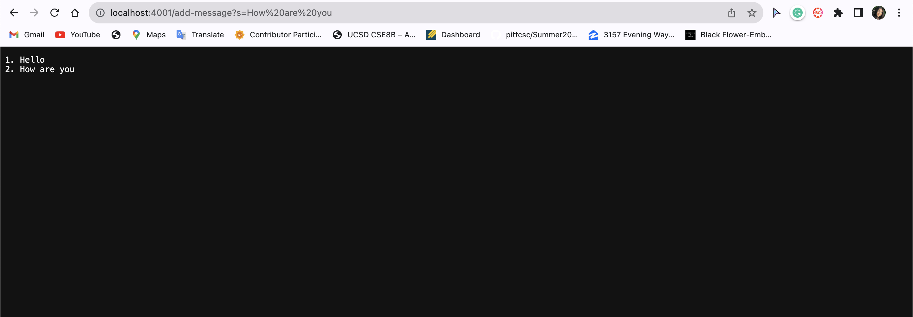
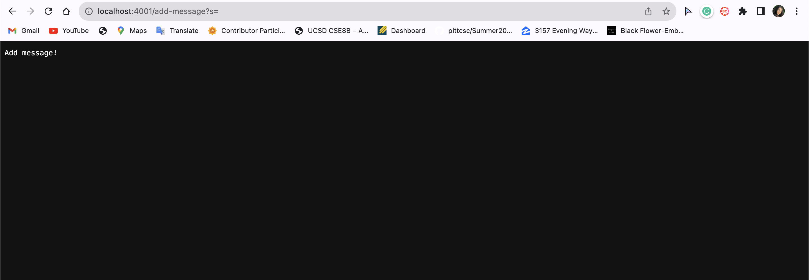
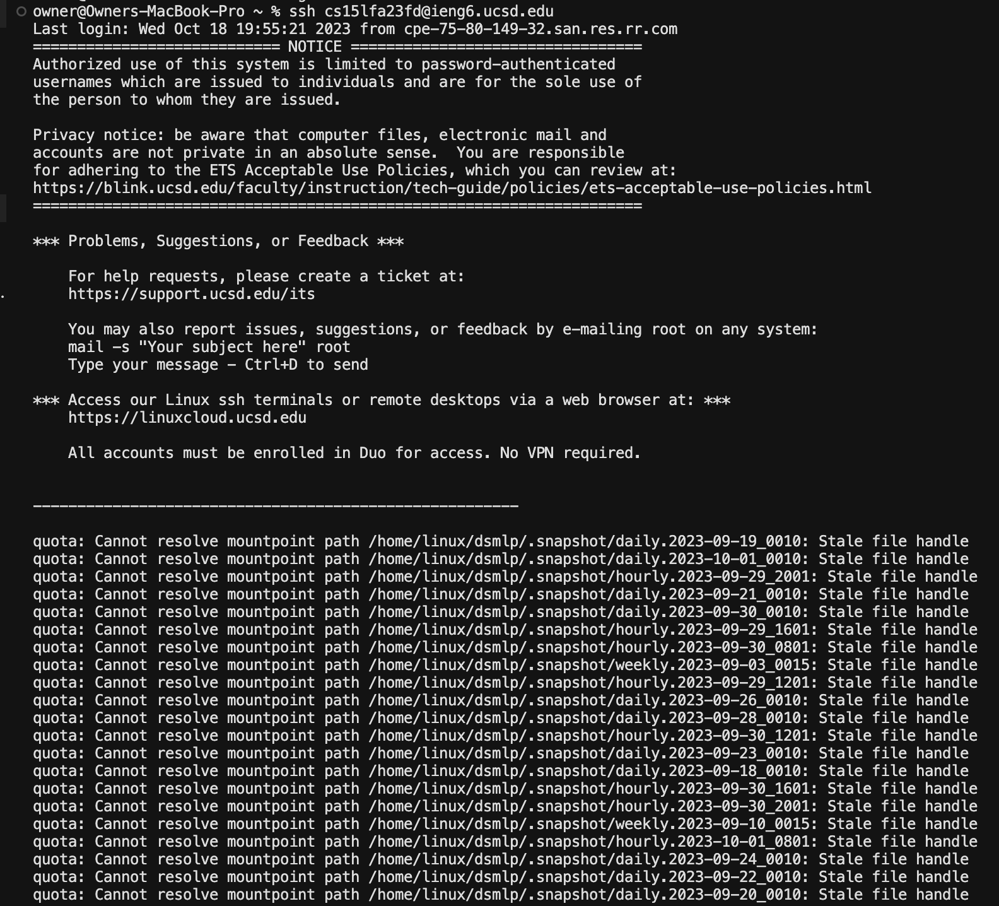

# Lab Report 2
## Part 1: `StringServer`
__StringServer Code__
```
# code for StringServer
import java.io.IOException;
import java.net.URI;

class StringServer implements URLHandler {
    int num = 1;
    StringBuilder messageStringBuilder = new StringBuilder();
    
    public String handleRequest(URI url) {     
        if (url.getPath().equals("/add-message")) {
            String[] parameters = url.getQuery().split("=");
            if (parameters[0].equals("s") && parameters.length == 2) {
                String message = parameters[1];
                messageStringBuilder.append(num).append(". ").append(message).append("\n");
                num++;
                return messageStringBuilder.toString();
            }
            return "Add message!";
        }

        else {
            return "Invalid input! Try again.";
        }
    }
}

class StringServerMain {
    public static void main(String[] args) throws IOException {
        if(args.length == 0) {
            System.out.println("Missing port number! Try any number between 1024 to 49151");
            return;
        }

        int port = Integer.parseInt(args[0]);

        Server.start(port, new StringServer());
    }
}
```

__StringServer Code Overview__
The StringServer class is responsible for handling incoming HTTP requests. It checks if the request path is "/add-message" and processes query parameters. If the path is "/add-message" and the query parameter "s" is provided, it appends the message to the messageStringBuilder along with an incrementing number and returns the updated message list. If the request is invalid, it returns an error message.

The StringServerMain class serves as the entry point for the program. It expects a command-line argument specifying the port on which the server should listen. If the port number is not provided, it prints a message indicating that the port number is missing.

If a port number is provided, it starts a server using the Server class (presumably provided elsewhere in your code) and passes an instance of the StringServer class to handle incoming requests.




__Methods Called__

the following methods would be called:

- StringServerMain.main: To start the server.
- StringServer.handleRequest: To handle the incoming HTTP request and add the message "Hello" to the messageStringBuilder.
- This code parses the provided port number from the command line arguments and starts the server with the StringServer to handle incoming requests.

The main method in the StringServerMain class would be called because you're starting the server from the command line with the provided port number.

Inside the main method, this code would execute:
```
int port = Integer.parseInt(args[0]);
Server.start(port, new StringServer());
```
Once the server is started, the StringServer instance will handle incoming requests. When accessing the URL "localhost:4001/add-message?s=Hello," the handleRequest method of the StringServer class will be called with the URI object representing this URL as its argument. Within the handleRequest method, the code will check if the request path is "/add-message," and it will proceed to parse the query parameters. In this case, it will split the query parameter by '=' and check if the parameter name is "s" and if the length of the parameters array is 2. If these conditions are met, the code will append the message "Hello" and all other following messages to the messageStringBuilder, increment the num variable, and return the updated message list.

__Relevant Arguments and Fields__

StringServerMain.main(String[] args):

Arguments: args is an array of command-line arguments.
Relevant Values:
args[0]: The first element of the args array contains the port number provided as a command-line argument.

StringServer.handleRequest(URI url):

Argument: url is a URI object representing the incoming HTTP request URL.
Relevant Values:
url.getPath(): This method retrieves the path component of the URL. In this case, it will be "/add-message".
url.getQuery(): This method retrieves the query component of the URL. In this case, it will be "s=Hello".

StringServer Fields:

int num: An integer field used to keep track of the message number.
StringBuilder messageStringBuilder: A StringBuilder used to store and construct the response message

__Changes in Values of Relevant Fields__

int num: The num field is used to keep track of the message number. In this specific request, since a new message is being added, the num field would be incremented by 1. If the initial value of num was 1, after processing this request, num would become 2.

StringBuilder messageStringBuilder: This StringBuilder is used to store and construct the response message. When you add a new message to it, it appends the message and increments the message number. In this specific request, the message "Hello" would be appended, and the response message would look something like "1. Hello\n" (assuming it's the first message added).


__Methods Called__

The StringServer class's handleRequest method would be called to handle the incoming request. The URI object representing the URL would be passed as an argument to this method.
Here's what would happen in the handleRequest method:

The code would first check if the request path is "/add-message," and it is indeed "/add-message" in this case.

It would then split the query component, which is "s=" in this specific request.

It would check if the query parameter name is "s" and if the length of the parameters array is 2.

In this case, the condition parameters[0].equals("s") would evaluate to true because the query parameter name is "s." However, the condition parameters.length == 2 would evaluate to false because there is no value provided after the equals sign.

Since the query parameter "s" is present but has no value, the code would not append anything to the messageStringBuilder. Instead, it would return the response "Add message!" as specified in the code.

__Relevant Arguments and Fields__

StringServer.handleRequest(URI url):

Argument: url is a URI object representing the incoming HTTP request URL.
Relevant Values:
url.getPath(): This method retrieves the path component of the URL, which is "/add-message" in this specific request.
url.getQuery(): This method retrieves the query component of the URL, which is "s=" in this specific request.
StringServer Fields:

int num: An integer field used to keep track of the message number. This field would not change in this specific request because no new message is added.

StringBuilder messageStringBuilder: A StringBuilder used to store and construct the response message. In this specific request, it wouldn't change because no message is provided, so nothing is appended to the messageStringBuilder.

__Changes in Values of Relevant Fields__

In the specific request "localhost:4001/add-message?s=" with no message provided in the query parameter, the values of the relevant fields in the StringServer class do not change. Here's why:

int num: The num field is used to keep track of the message number. In this specific request, since no message is provided, there is no new message to add, and as a result, the num field remains unchanged.

StringBuilder messageStringBuilder: This StringBuilder is used to store and construct the response message, and in this request, no new message is appended because the query parameter "s" is empty. As a result, the messageStringBuilder remains unchanged, and the response message would still be "Add message!" without any changes to the message list.

---
## Part 2: `ls`
__Private Key Path__


__Public Key Path__


__No Password Required__


---
## Part 3: Learned from Lab
In Lab 2, something I learned that I previously did not know was the `ssh` command. I knew of others such as `git clone` and `cat`. I've never really had much experience in working with remote servers; however, during this lab I was able to learn what the `ssh` command is and how to use it. I now know that `ssh` allows for remote login and remote execution of commands on a server or another computer over a network. Moreover, it is commonly used for securely accessing and managing remote systems, it encrypts data and provides authentication to ensure secure communication.
