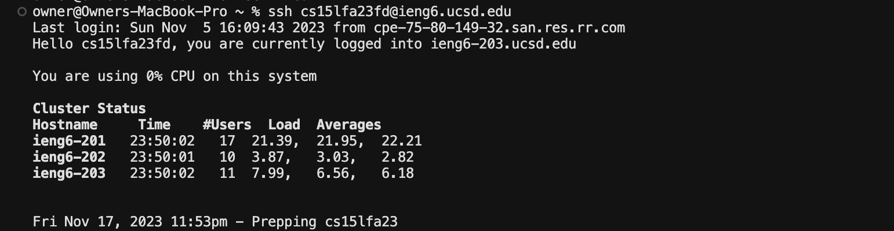
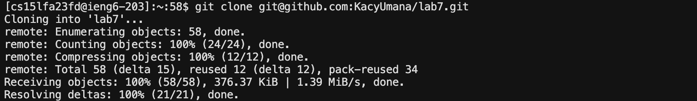
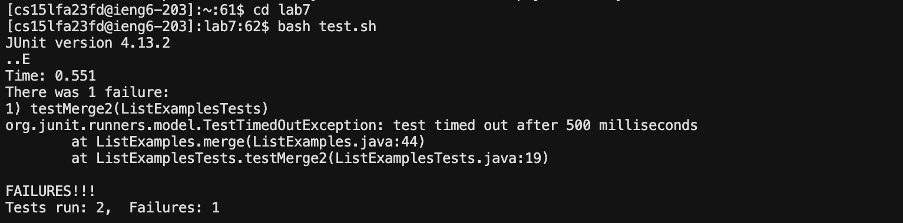
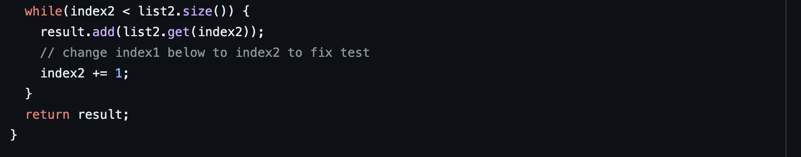
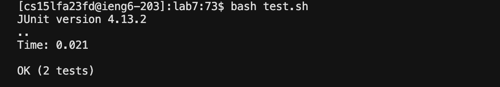
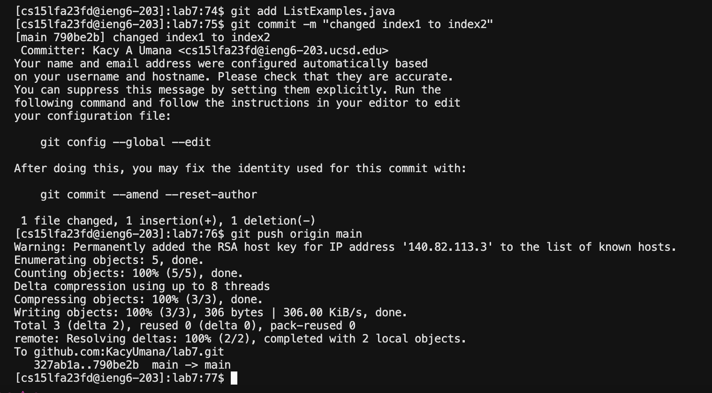

# Lab Report 4: Vim
## Log in to ieng6

Keys Pressed: `Ctrl R` `s` `<enter>`
In order to save time from writing out the whole command for logging in to ieng6, I used `Ctrl R` to search through my command history and typed the beginning letter to the command `s` which autocompleted to `ssh cs15fa23fd@ieng6.ucsd.edu`. I then pressed `<enter>` to execute the command and log in to ieng6.

## Clone Fork to Repository

Keys Pressed: `Ctrl R` `cl` `<enter>`

## Run Failing Tests

Keys Pressed: `cd l` `<tab>` `<enter>` `Ctrl R` `ba` `<enter>`

## Fix Failing Test

Keyes Pressed: `vim L` `<tab>` `.java` `<enter>` `<j>` x43 `<l>` x11 `x` `<enter>` `<esc>` `i` `2` `<enter>` `<esc>` `<esc>` `:wq` `<enter>`

## Run Succeeding Tests

Keys Pressed: `<up>` `<up>` `<enter>`

## Commit and Push Changes

Keys Pressed: `Ctrl R` `ad` `<enter>` `Ctrl R` `com` `<enter>` `Ctrl R` `pu` `<enter>`
